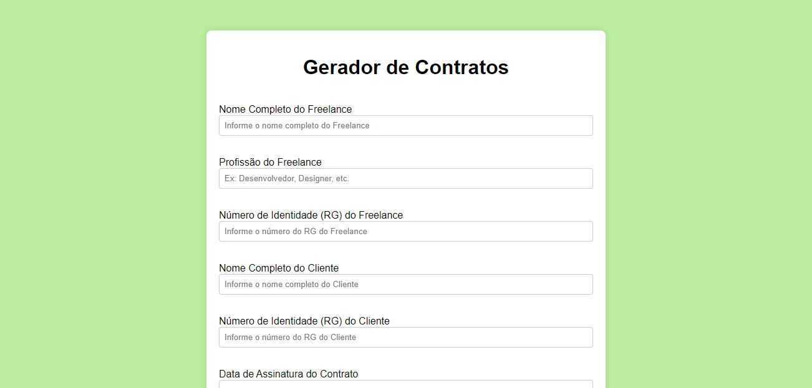
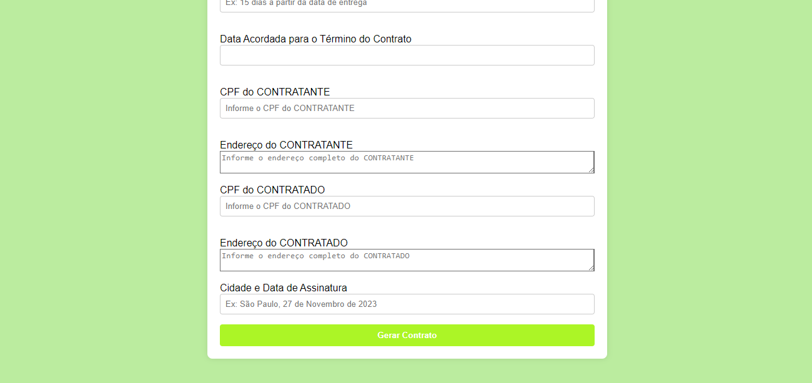
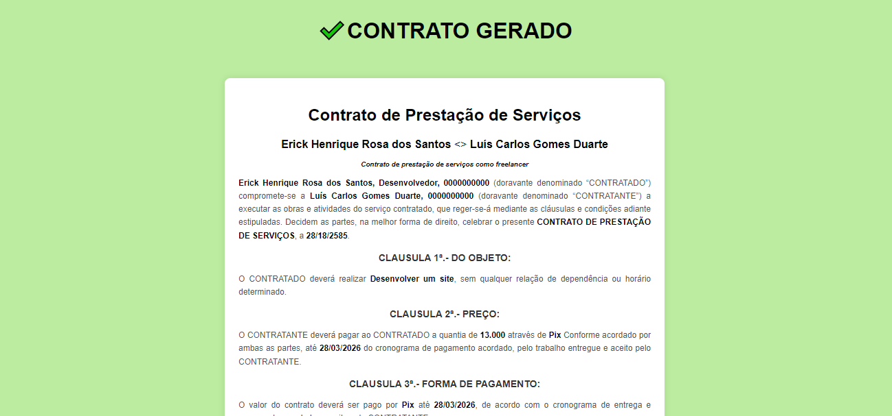
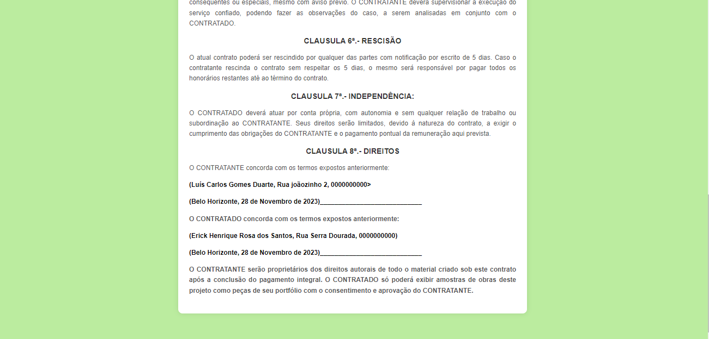
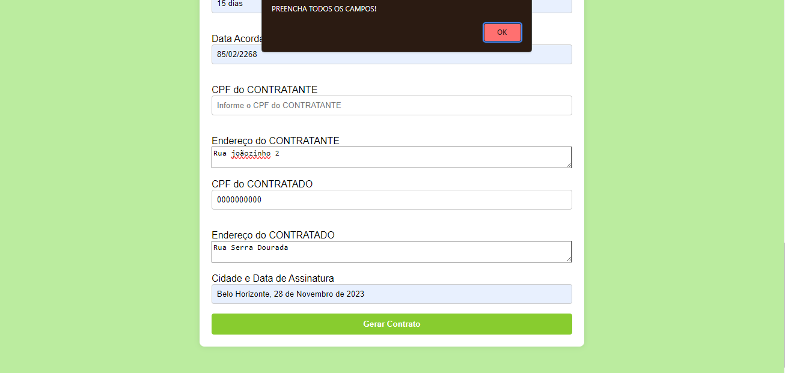

# GeradorContratosPhp
Criei esse gerador simples de contratos de freelancer &lt;> contratante para estudos da linguagem php. Me atentei para que o botão só faça o submit caso todos os campos estejam preenchidos.

